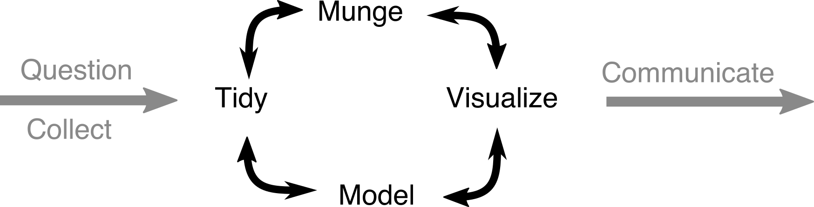

Project Management with git and GitHub
========================================================
author: Ian Breckheimer
date: 12 October 2015
autosize: true

Objectives
========================================================
- Background / Context (~5min)
- Demo a Simple Workflow (~10min)
- Practice forking and updating (~35min)

Project Management Challenges
========================================================
- Organizing data and code
- Tracking changes to both
- Sharing results, code, and data

Git - "Track Changes" for code
========================================================

Four Basic Operations
========================================================
- **Pull** - Download and sync changes from remote repository.

(do some work)

- **Stage** - Mark which files to update in remote.
- **Commit** - Make changes "permanent". Note what changes you made.
- **Push** - Update remote repository with changes.

Important Distinctions
========================================================
**git $\neq$ GitHub**

**R $\neq$ RStudio**

Important Warning
========================================================

Make sure that the local directories where you store your repositories are **not** in a Dropbox folder.

A Simple Workflow
========================================================

**Initial Setup**
- Create GitHub Repository
- Checkout Repository in RStudio.
- Create directory structure.
- Add data.
- Add skeleton script.
- Commit and Push.

***

**Ongoing Work**
- Work on your script/data.
- Save changes.
- Stage changed files.
- Pull remote changes.
- Commit and push.

OK, Now you try
========================================================
- **Fork** "[Week1_HelloWorld](https://github.com/UW-RSeminar-Fall2015/Week1_HelloWorld)". It will appear in your GitHub workspace.
- Use RStudio to clone the repository to your local machine.
- Modify it and save your changes.
- Stage, commit and push changes.
